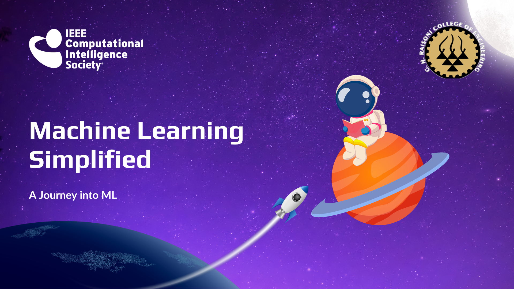

# Machine Learning Simplified Bootcamp

🚀 Welcome to the Machine Learning Simplified Bootcamp repository! This repository is your rocket ship 🚀 to mastering essential machine learning concepts. Whether you've been with us in person or are joining from afar, you're in for an exciting journey!

If you missed any sessions, don't fret! We've captured the magic and stored it in our YouTube playlist. Your front-row seat is just a click away:

🎥 [Machine Learning Simplified Bootcamp YouTube Playlist](https://www.youtube.com/your_playlist_link_here)

## Table of Contents

| Day   | Topic                  | Code Files          |
|-------|------------------------|---------------------|
| Day 1 | Linear Regression      | [Day1_Code](./Day-1/)  |
| Day 2 | Decision Trees         | [Day2_Code](./Day-2/)  |
| Day 3 | K-Means Clustering     | [Day3_Code](./Day-3/)  |
| Day 4 | AutoML                 | [Day4_Code](./Day-4/)  |

## Launching Your Code

Feel the surge of energy? If you're taking part in the bootcamp and want to showcase your skills, head over to the [`SUBMISSIONS.md`](./SUBMISSIONS.MD) file in this repository. The stars await your code, so make it shine!

We've distilled knowledge into bytes and carefully crafted learning potions. Embark on this adventure with curiosity as your compass and innovation as your map. Your destination? Uncharted lands of machine learning marvels. 🌌✨

Now, let's venture forth into the realm of data, algorithms, and boundless possibilities!

Made with <B>💖</B> by <B>[Chaitanya_Wankhede](https://github.com/Babban33?tab=repositories)</B>
